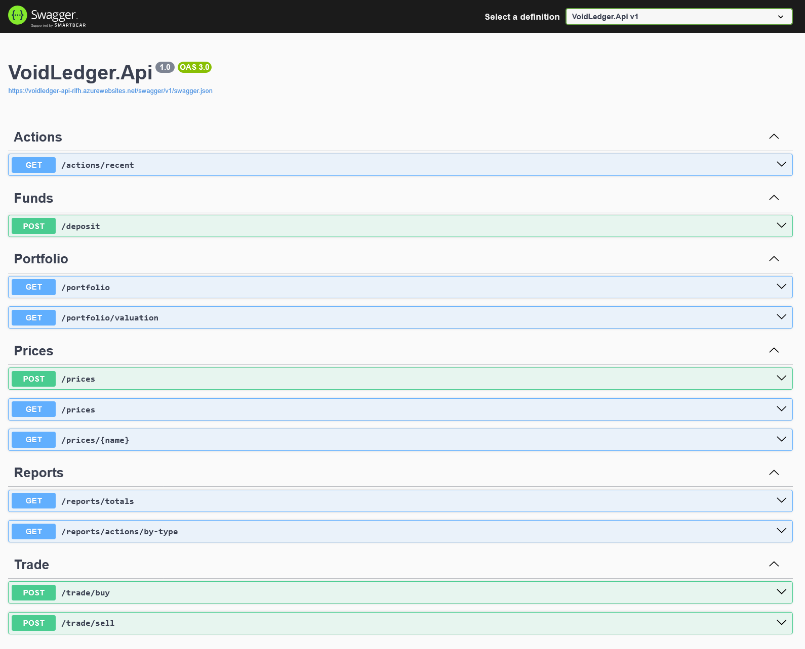
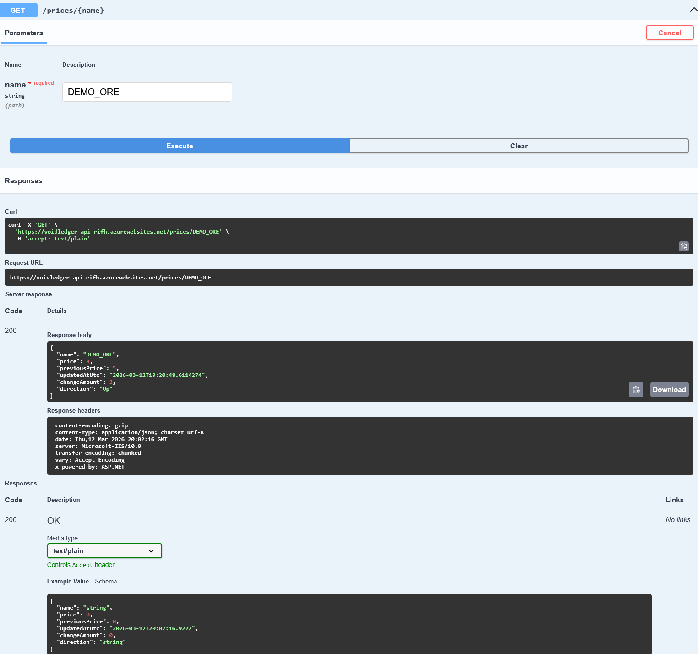
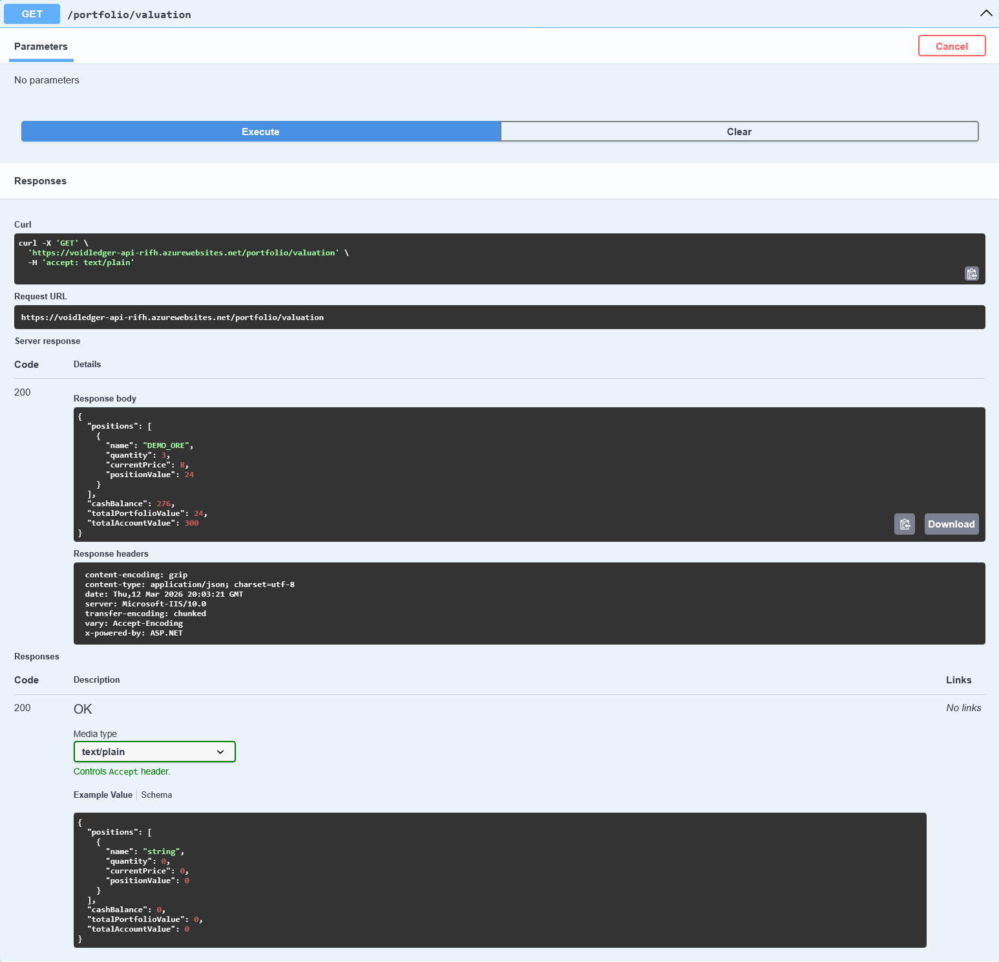

# Void Ledger

Void Ledger is a backend-first sci-fi trading API built with ASP.NET Core and Azure SQL.

It is a portfolio project focused on demonstrating:

- clean API design
- layered backend architecture
- EF Core persistence
- Azure deployment
- Docker support
- automated tests
- structured JSON endpoints for trading and reporting

## Live Demo

Swagger UI:  
https://voidledger-api-rifh.azurewebsites.net/swagger/index.html

This is a **public shared demo instance**.

That means:

- data is shared between visitors
- state may change between sessions
- using a unique commodity name is recommended when testing the API

A good demo name is something like `DEMO_ORE_123`.

---

## Screenshots

### Swagger UI overview


### Price movement example


### Portfolio valuation



---

## What the API Does

Void Ledger models a simple trading account that can:

- set commodity prices
- deposit cash
- buy commodities
- sell commodities
- inspect holdings
- inspect structured portfolio valuation
- inspect recent actions and totals
- inspect price movement metadata

### Current Flavor Features

To make the market feel less static, prices include movement metadata:

- current price
- previous price
- updated-at UTC timestamp
- derived change amount
- derived direction (`Up`, `Down`, `Flat`, `Unknown`)

---

## Example Demo Flow

A reviewer can try the project with this flow:

1. `POST /prices` with a new commodity name
2. `POST /prices` again with a different price
3. `GET /prices/{name}` to see `previousPrice`, `changeAmount`, and `direction`
4. `POST /deposit`
5. `POST /trade/buy`
6. `POST /trade/sell`
7. `GET /portfolio/valuation`
8. `GET /actions/recent?take=10`
9. `GET /reports/totals`

---

## Main Endpoints

### Prices
- `POST /prices`
- `GET /prices`
- `GET /prices/{name}`

### Trading
- `POST /deposit`
- `POST /trade/buy`
- `POST /trade/sell`

### Portfolio
- `GET /portfolio`  
  Human-readable legacy text report
- `GET /portfolio/valuation`  
  Structured JSON valuation endpoint

### Actions / Reports
- `GET /actions/recent?take=10`
- `GET /reports/totals`
- `GET /reports/actions/by-type?type=Buy&take=10`

---

## Example Response Shapes

### `GET /prices/{name}`

```json
{
  "name": "DEMO_ORE",
  "price": 8,
  "previousPrice": 5,
  "updatedAtUtc": "2026-03-12T19:20:48.6114274",
  "changeAmount": 3,
  "direction": "Up"
}
```

### `GET /portfolio/valuation`

```json
{
  "positions": [
    {
      "name": "DEMO_ORE",
      "quantity": 3,
      "currentPrice": 8,
      "positionValue": 24
    }
  ],
  "cashBalance": 276,
  "totalPortfolioValue": 24,
  "totalAccountValue": 300
}
```

### `GET /reports/totals`

```json
{
  "actionCount": 5,
  "totalDeposited": 300,
  "totalSpentOnBuys": 32,
  "totalEarnedFromSells": 8,
  "netCashflow": 276
}
```

---

## Tech Stack

- **C# / .NET 8**
- **ASP.NET Core Web API**
- **Entity Framework Core**
- **Azure SQL**
- **Azure App Service**
- **xUnit**
- **GitHub Actions**
- **Docker**

---

## Architecture

The solution is split into three projects:

### `VoidLedger.Api`
HTTP/API boundary.

Responsibilities:
- controllers
- request/response DTOs
- EF Core DbContext, entities, migrations
- HTTP result mapping
- DI wiring
- deployment/runtime configuration

### `VoidLedger.Core`
Core application logic.

Responsibilities:
- service layer
- result contracts
- business rules
- store abstractions
- trading orchestration
- read models

### `VoidLedger.Core.Tests`
Automated tests.

Responsibilities:
- service-layer unit tests
- fake store/test support
- critical path regression coverage

---

## Design Decisions

### SQL Is the Source of Truth
The runtime no longer depends on in-memory state.  
Accounts, prices, holdings, and action logs are persisted in Azure SQL.

### Thin Controllers
Controllers stay small and delegate behavior to services.

### Stable Result Contract
Expected business failures are returned through `OpResult + ErrorCode` and mapped to HTTP responses consistently.

### Centralized Exception Handling
Unexpected exceptions are handled globally and returned as clean `500 ProblemDetails`.

### Additive API Evolution
Older text/report-style endpoints were kept where useful, while newer structured JSON endpoints were added for cleaner machine-readable contracts.

---

## Running Locally

### 1. Restore and build

```bash
dotnet restore
dotnet build
```

### 2. Run the API

```bash
dotnet run --project VoidLedger.Api
```

### 3. Open Swagger

Open the local Swagger URL shown by ASP.NET Core at startup.

---

## Local Configuration

The project uses a connection string named:

`ConnectionStrings:VoidLedgerDb`

For local development, store secrets outside the repo (for example, User Secrets).

The live Azure deployment uses Azure App Service configuration for environment-specific settings.

---

## Running Tests

```bash
dotnet test
```

The test suite covers critical backend behavior such as:

- valid/invalid price setting
- valid/invalid deposits
- buy/sell success and failure paths
- missing price / missing holding / oversell
- invalid name handling
- portfolio valuation behavior
- structured JSON/reporting behavior

---

## Running with Docker

Build the image:

```bash
docker build -t voidledger-api:dev .
```

Run the container:

```bash
docker run --rm --name voidledger-api-dev -p 8080:8080 -e ASPNETCORE_ENVIRONMENT=Development voidledger-api:dev
```

Then open Swagger through the containerized app.

---

## Deployment

The API is deployed to **Azure App Service** and uses **Azure SQL** for persistence.

Live Swagger UI:  
https://voidledger-api-rifh.azurewebsites.net/swagger/index.html

Deployment-related work completed in this project includes:

- Dockerizing the API
- publishing to Azure App Service
- configuring Azure App Settings / connection strings
- applying EF Core migrations to Azure SQL
- verifying persisted behavior survives restart/redeploy

---

## Current Scope / Limitations

This project is intentionally scoped as a backend portfolio project.

### Included
- single-account trading flow
- persisted prices, holdings, actions, and balance
- structured reporting endpoints
- price movement metadata
- live Azure deployment

### Deferred / intentionally not included
- authentication / authorization
- multi-user account isolation
- frontend client
- background market simulation
- stations, factions, travel time, shipments
- production-grade security / rate limiting

---

## Notes for Reviewers

- The live app is a **shared public demo**.
- Data can change between sessions.
- Use a unique commodity name when testing.
- `/portfolio` is intentionally kept as a human-readable legacy endpoint.
- `/portfolio/valuation` is the structured JSON portfolio endpoint.

---

## Why This Project Exists

Void Ledger was built as a deliberate backend learning project focused on becoming job-ready in:

- C#
- ASP.NET Core
- EF Core
- SQL-backed API design
- testing
- deployment
- backend architecture
- initial console/domain modeling
- API extraction
- test hardening
- Dockerization
- Azure deployment
- SQL-backed persistence
- endpoint polish

