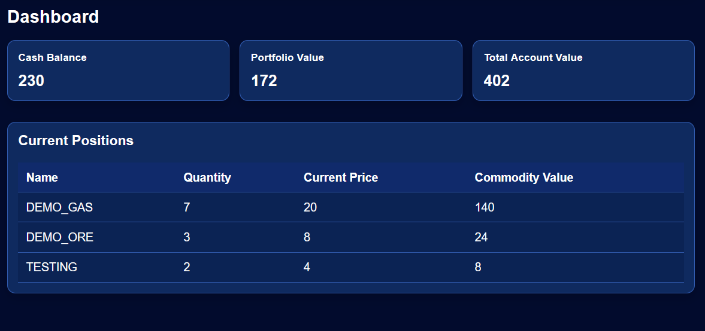
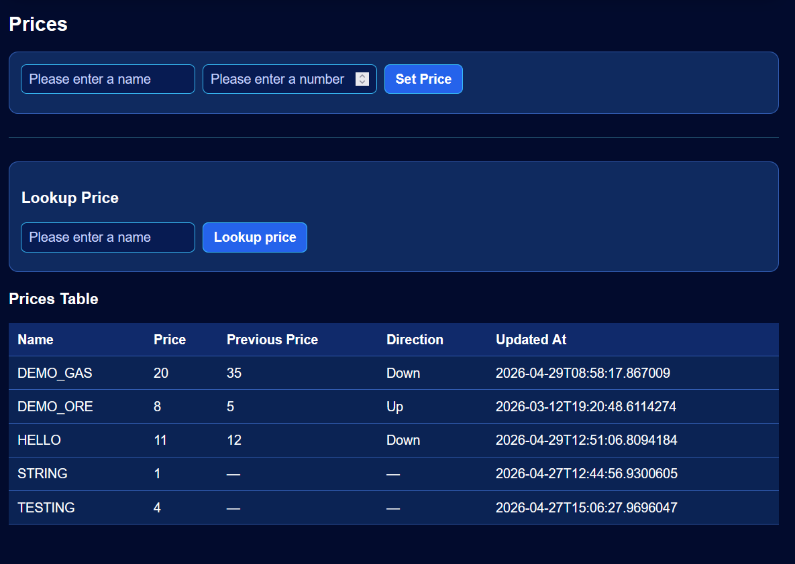
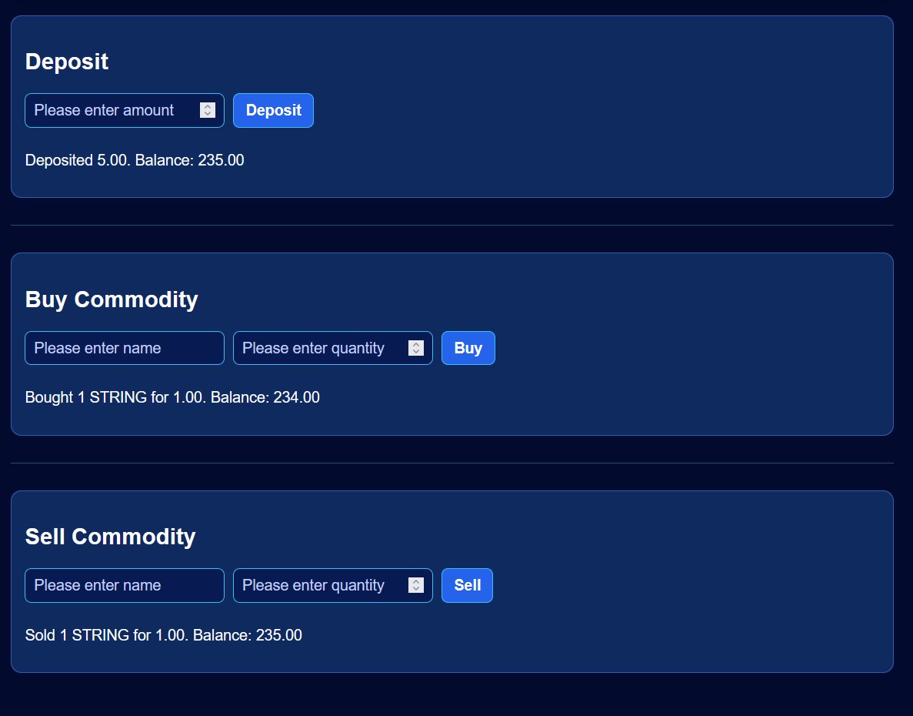
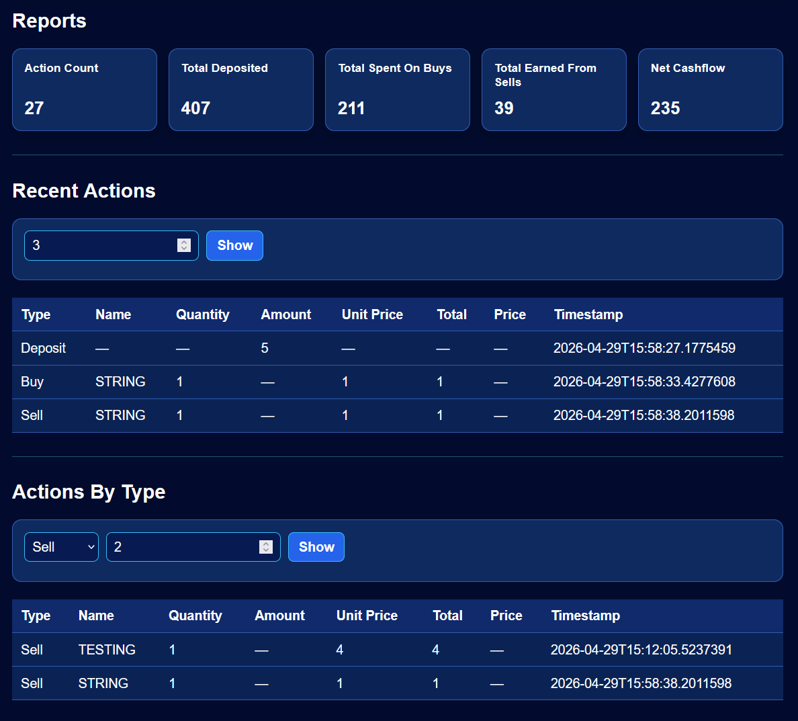

# Void Ledger — Fullstack Trading Simulation System

Void Ledger is a fullstack trading simulation system built around a fictional commodity market.

The backend is an ASP.NET Core API that handles prices, trading rules, portfolio valuation, reporting, persistence, and validation. The frontend is a React dashboard that consumes the live API and provides a simple interface for viewing portfolio data, updating prices, trading commodities, and reviewing account activity.

## Live Demo

- Live App: www.voidledger-rifh4.dev
- API / Swagger: https://voidledger-api-rifh.azurewebsites.net/swagger/index.html

**Note on the live demo:** The database is publicly shared. Because of this, the state might change while you are using it if someone else is also interacting with the app or API. If you want to test price updates or trading flows, it helps to use a unique commodity name, for example `TEST_ORE_948`.

## Screenshots

### Dashboard


### Prices


### Trading


### Reports


## Features

### Dashboard

- View cash balance, portfolio value, and total account value
- View current commodity positions
- Display position values based on current market prices

### Prices

- List current commodity prices
- Set or update a commodity price
- Look up a specific commodity by name
- Show previous price, change amount, and movement direction

### Trading

- Deposit virtual cash
- Buy commodities using the current market price
- Sell owned commodities
- Display backend validation errors clearly in the UI

### Reports

- View account totals
- Load recent ledger actions
- Filter actions by type
- Review deposits, buys, sells, and price-related activity

## Tech Stack

### Backend

- C# / .NET 8
- ASP.NET Core Web API
- Entity Framework Core
- Azure SQL
- xUnit
- Docker
- Swagger / OpenAPI

### Frontend

- React
- Vite
- React Router
- CSS
- Service-based API access

### Deployment

- Azure App Service for the backend API
- Azure Static Web Apps for the frontend
- GitHub Actions
- Azure SQL for persistence

## Architecture

Void Ledger is split into a backend API and a frontend client.

The backend handles the business rules, validation, persistence, portfolio valuation, and reporting. The frontend is a React single-page application that consumes the backend API and presents the system through routed pages.

The frontend is organized around four main pages:

- `Dashboard`
- `Prices`
- `Trading`
- `Reports`

API calls in the frontend are kept in service files instead of being written directly inside React components. Page components own their local UI state, while derived values are calculated during rendering. Data loading uses `useEffect` only where the page needs to load data automatically, such as the Dashboard and Reports totals. User-triggered actions, such as buying, selling, updating prices, or looking up a commodity, stay inside submit or click handlers.

The frontend also uses a small API configuration helper so local development can use the Vite `/api` proxy, while production builds use the deployed backend URL through `VITE_API_BASE_URL`.

## Backend Project Structure

The backend is divided into separate projects to keep responsibilities clear.

### `VoidLedger.Api`

This project handles the web layer. It contains the controllers, dependency injection setup, Entity Framework Core `DbContext`, API configuration, and HTTP response mapping.

The controllers are intentionally thin. Their job is to receive HTTP requests, call the service layer, and return the correct HTTP response.

### `VoidLedger.Core`

This project contains the main business logic, including the ledger and trading services.

The core layer defines store interfaces such as `ILedgerStore`, so the business logic does not directly depend on Entity Framework Core.

### `VoidLedger.Core.Tests`

This project contains the xUnit test suite.

The tests use fake in-memory store implementations so the main business paths can be tested without requiring a real database connection.

## Frontend Project Structure

The React frontend is located in:

```text
void-ledger-client
```

Important frontend folders:

```text
void-ledger-client/src/pages
void-ledger-client/src/services
void-ledger-client/src/components
```

The page components contain the UI state and rendering logic for each route.

The service files handle API requests, URL construction, response parsing, and backend error handling.

Shared display components include:

- `SummaryCard`
- `ActionsTable`

## Main API Endpoints

### Prices

- `POST /prices`
- `GET /prices`
- `GET /prices/{name}`

### Trading

- `POST /deposit`
- `POST /trade/buy`
- `POST /trade/sell`

### Portfolio and Reporting

- `GET /portfolio/valuation`
- `GET /actions/recent?take=10`
- `GET /reports/totals`
- `GET /reports/actions/by-type?type=Buy&take=10`

## Design Choices

### OpResult Pattern

Instead of letting expected business validation failures become exceptions, the core services return operation results.

For example, buying without enough cash or selling more than the current holding is treated as a controlled business result. The API layer maps these results into appropriate HTTP responses with clear error messages.

This keeps expected validation failures separate from unexpected system exceptions.

### Portfolio Valuation Logic

The `/portfolio/valuation` endpoint calculates the current account state based on cash balance, holdings, and current commodity prices.

If a position exists but the current price is missing, the endpoint does not crash or assume a false value. Instead, it returns a nullable position value while still calculating the values that can be calculated safely.

### Frontend State Discipline

The React frontend follows a simple separation:

- API response data is stored in state.
- User input is stored in state.
- Derived display values are calculated during render.
- Automatic page-load requests use `useEffect`.
- User-triggered requests stay in event handlers.

This keeps the frontend predictable and avoids unnecessary global state.

## Infrastructure and Deployment

### Backend Deployment

The backend API is deployed to Azure App Service and uses Azure SQL for persistence.

The API was originally built as a backend-focused project with Docker and GitHub Actions. It includes a Dockerfile for containerized deployment and a GitHub Actions workflow for build/test automation.

### Frontend Deployment

The frontend is deployed separately with Azure Static Web Apps.

The React app is built with Vite and deployed from the `void-ledger-client` folder. The production frontend uses:

```text
VITE_API_BASE_URL
```

to call the deployed backend API.

Client-side routing is supported through:

```text
void-ledger-client/public/staticwebapp.config.json
```

so routes like `/prices`, `/trading`, and `/reports` can be refreshed directly in the browser.

### CORS

Because the frontend and backend are deployed to different Azure URLs, the backend App Service must allow the frontend origin through CORS.

## Running the Project Locally

### Backend

From the repository root, restore packages:

```bash
dotnet restore
```

Run the API project:

```bash
dotnet run --project VoidLedger.Api
```

The backend requires a SQL Server connection string named:

```text
VoidLedgerDb
```

When running locally, Swagger is available from the API launch URL.

### Frontend

Go to the frontend folder:

```bash
cd void-ledger-client
```

Install dependencies:

```bash
npm install
```

Run the development server:

```bash
npm run dev
```

In local development, Vite proxies `/api` requests to the deployed backend API. This is configured in:

```text
void-ledger-client/vite.config.js
```

Build the frontend:

```bash
npm run build
```

## Running with Docker

The backend API can also be built and run with Docker:

```bash
docker build -t voidledger-api:dev .
```

```bash
docker run --rm --name voidledger-api-dev -p 8080:8080 -e ASPNETCORE_ENVIRONMENT=Development voidledger-api:dev
```

## Testing

Run the backend test suite with:

```bash
dotnet test
```

The tests cover the main business paths, including:

- rejecting negative deposits
- rejecting invalid price updates
- preventing users from selling more than they own
- handling missing prices and missing holdings
- portfolio valuation behavior under different conditions

## Notes and Limitations

- The live app uses shared demo data, so values may change over time.
- The Azure Static Web Apps URL is automatically generated by Azure.
- A cleaner production URL would require a custom domain.
- The current MVP assumes a single trading account.
- Authentication and multi-user account isolation are intentionally not included.
- Azure SQL firewall and connection settings may need adjustment when running or deploying from a new environment.

## What I’d Improve Next

If I continued expanding this project, the next improvements I would consider are:

- adding authentication and account isolation
- supporting multiple users or portfolios
- storing full price history instead of only latest and previous prices
- adding richer frontend validation
- improving the report views with charts or export options
- adding more end-to-end deployment documentation
